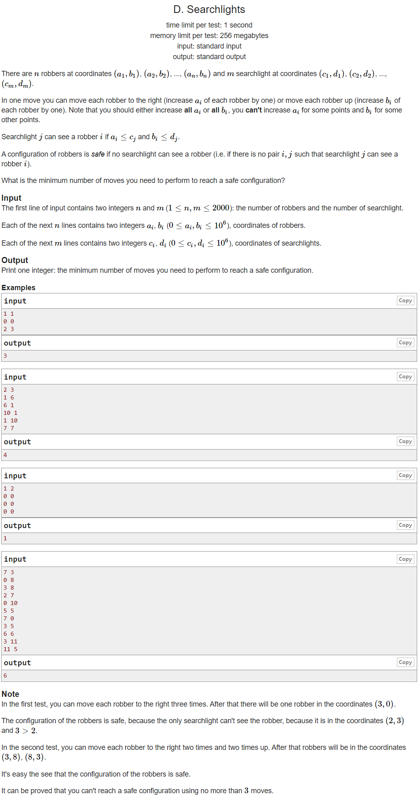

---
## 풀이
* 모든 도둑들에 대해 모든 탐조등을 피할 수 있는 경우를 찾아야하기 때문에, `n*m` 개의 케이스에 대해 다음과 같은 연산을 적용한다.
* 도둑의 위치를 `(a_i, b_i)`, 탐조등의 위치를 `(c_j, d_j)`라고 하면 `a_i > c_j`인 경우는 도둑이 움직이지 않아도 무조건 탐조등의 범위를 벗어나기 때문에 무시한다.
* `a_i <= c_j`인 경우는 도둑이 x 방향으로 `c_j - a_i + 1`만큼 움직이지 않는다면 탐조등의 범위를 벗어나기 위해 y 방향으로 `d_j - b_i + 1`만큼 움직여줘야 된다.
* 이 때 `d_j - b_i`가 음수일 수도 있기 때문에 정확히는 `max(0, d_j - b_i + 1)`만큼 움직여줘야 된다.
* `ar[k]`를 탐조등보다 `k`이상 x좌표값이 작은 도둑이 탐조등의 범위를 벗어나기 위해 y방향으로 이동해야 하는 최소 거리를 나타내기로 한다.
* k를 높은 숫자부터 차례로 줄여가며 ar[k]를 탐색하면서 x방향으로 움직여야 하는 값과 y방향으로 움직여야 하는 값의 합의 최소값을 기록한다. 

```cpp
#include <bits/stdc++.h>
using namespace std;
using ll = long long int;
using pii = pair<int,int>;
using pll = pair<long,long>;
#define pb push_back
#define ppb pop_back
#define ff first
#define ss second
#define all(x) x.begin(), x.end()
#define rall(x) x.rbegin(), x.rend()

struct fast_ios { fast_ios() { ios::sync_with_stdio(false); cin.tie(NULL); } } fast_ios_;

/*--------------------------------------------------*/

#define MOD (int)(1e9+7)
#define LINF (ll)1e18
#define INF (int)1e9

int solve() {
	int n, m; cin >> n >> m;
	vector<int> a(n), b(n), c(m), d(m);
	vector<int> ar(1e6+10);
	for (int i=0; i<n; ++i) cin >> a[i] >> b[i];
	for (int i=0; i<m; ++i) cin >> c[i] >> d[i];
	for (int i=0; i<n; ++i) for (int j=0; j<m; ++j) {
		if (c[j]-a[i]>=0) {
			ar[c[j]-a[i]] = max(ar[c[j]-a[i]], d[j]-b[i]+1);
		}
	}
	int ans = INF, mx = 0;
	for (int i=1e6; i>=0; --i) {
		mx = max(mx, ar[i]);
		ans = min(ans, i+mx);
	}
	printf("%d\n", ans);

	return 0;
}

int main() {
	//int t; cin >> t;
	//while (t--)
		solve();

	return 0;
}
```

---
## 출처
https://codeforces.com/problemset/problem/1408/D