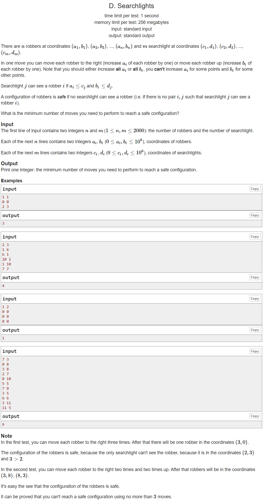

---
## 풀이

```cpp
#include <bits/stdc++.h>
using namespace std;
using ll = long long int;
using pii = pair<int,int>;
using pll = pair<long,long>;
#define pb push_back
#define ppb pop_back
#define ff first
#define ss second
#define all(x) x.begin(), x.end()
#define rall(x) x.rbegin(), x.rend()

struct fast_ios { fast_ios() { ios::sync_with_stdio(false); cin.tie(NULL); } } fast_ios_;

/*--------------------------------------------------*/

#define MOD (int)(1e9+7)
#define LINF (ll)1e18
#define INF (int)1e9

int solve() {
	int n, m; cin >> n >> m;
	vector<int> a(n), b(n), c(m), d(m);
	vector<int> ar(1e6+10);
	for (int i=0; i<n; ++i) cin >> a[i] >> b[i];
	for (int i=0; i<m; ++i) cin >> c[i] >> d[i];
	for (int i=0; i<n; ++i) for (int j=0; j<m; ++j) {
		if (c[j]-a[i]>=0) {
			ar[c[j]-a[i]] = max(ar[c[j]-a[i]], d[j]-b[i]+1);
		}
	}
	int ans = INF, mx = 0;
	for (int i=1e6; i>=0; --i) {
		mx = max(mx, ar[i]);
		ans = min(ans, i+mx);
	}
	printf("%d\n", ans);

	return 0;
}

int main() {
	//int t; cin >> t;
	//while (t--)
		solve();

	return 0;
}
```

---
## 출처
https://codeforces.com/contest/1408/problem/D