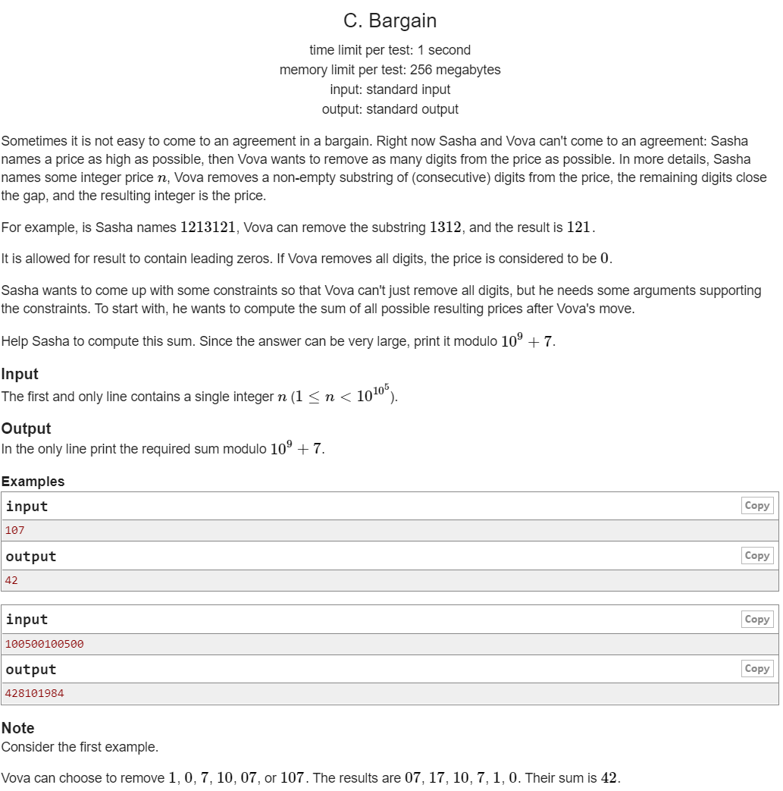

---
## 풀이
* n을 구성하고 있는 각각의 자릿수에 대해 그 숫자의 왼쪽에 있는 수들이 지워지는 경우와, 그 숫자의 오른쪽에 있는 수들이 지워지는 경우를 더한 값에 그 숫자를 곱해주면 그 숫자가 정답에 얼마나 포함되어 있는지를 계산할 수 있다.
* n을 구성하고 있는 어떤 자릿수가 `0-indexed` 표기법으로 왼쪽부터 i번째 자릿수라고 한다면, 그 수의 왼쪽에 있는 수가 지워지는 경우의 수는 1부터 i까지 더한 값이 되므로 총 `i*(i+1)/2`개이다.
* n의 길이를 m이라고 했을 때 위의 모든 경우에 대해 i번째 자릿수는 오른쪽에 `m-i-1`개의 숫자가 있다.
* 따라서 i번째 자릿수에 왼쪽에 있는 숫자를 지우는 경우는 다음의 값을 정답에 추가하면 된다.


* n을 구성하고 있는 i번째 자릿수의 오른쪽에 있는 숫자가 지워지는 경우는 오른쪽의 숫자가 `m-i-1`개 있다고 했을 때 1개 지워지는 경우부터 `m-i-1`개 지워지는 경우를 모두 고려하면 된다.
* 그 경우들에 해당하는 값은 다음과 같다.


* 위 값은 `m-i`의 값에 의해서만 바뀌는 고정된 값이어서 여러번 사용할 수 있으므로 미리 계산해놓으면 편하다.

```cpp
#include <bits/stdc++.h>
using namespace std;
using ll = long long int;
using pii = pair<int,int>;
using pll = pair<long,long>;
#define pb push_back
#define ppb pop_back
#define ff first
#define ss second
#define all(x) x.begin(), x.end()
#define rall(x) x.rbegin(), x.rend()

struct fast_ios { fast_ios() { ios::sync_with_stdio(false); cin.tie(NULL); } } fast_ios_;

/*--------------------------------------------------*/

#define MOD (int)(1e9+7)
#define LINF (ll)1e18
#define INF (int)1e9

int solve() {
	vector<ll> ri(2e5);
	vector<ll> dg(2e5);
	dg[0] = 1;
	for (int i=1; i<2e5; ++i) {
		dg[i] = (dg[i-1]*10)%MOD;
	}
	for (int i=1; i<2e5; ++i) {
		ri[i] = (ri[i-1]+i*dg[i-1])%MOD;
	}
	string s; cin >> s;
	int sz = s.size();
	ll ans = 0;
	for (ll i=0; i<sz; ++i) {
		ll l = ((i*(i+1)/2)*dg[sz-i-1])%MOD;
		ll r = ri[sz-i-1];
		ans = (ans+(s[i]-'0')*(l+r))%MOD;
	}
	printf("%lld\n", ans);

	return 0;
}

int main() {
	//int t; cin >> t;
	//while (t--)
		solve();

	return 0;
}
```

---
## 출처
https://codeforces.com/problemset/problem/1422/Chttps://codeforces.com/problemset/problem/1422/C