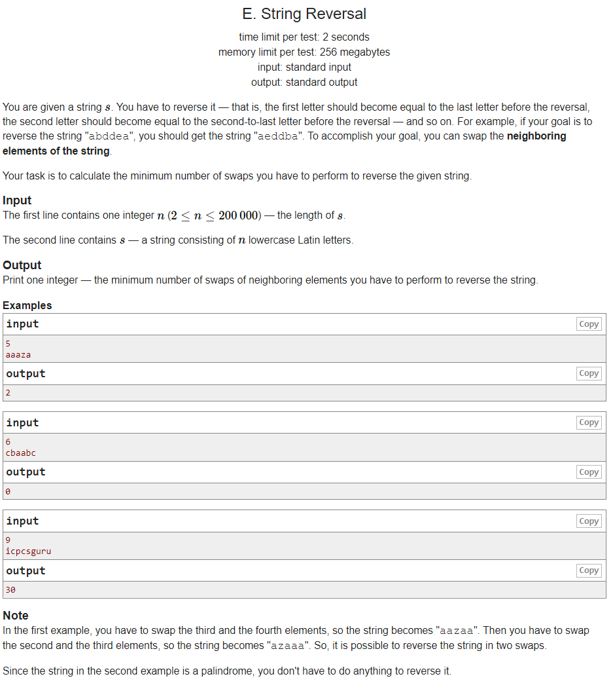

---
## 풀이
* 주어진 문자열 `s`를 거꾸로 정렬한 문자열을 `rs`라고 한다.
* 문자열 `s` 안의 연속한 문자 2개를 swap하는 것을 반복하여 `rs`로 만드는 과정에서 연속한 2개의 문자가 서로 같다면 그 문자들을 swap하는 것은 불필요하므로, `rs`를 구성하고 있는 모든 알파벳에 대하여 문자 `c`들의 순서는 반드시 `s`에서와 같은 순서를 유지하고 있어야 한다.
* `s`를 `ns`로 만들기 위해 문자열 `ns`의 가장 왼쪽 문자에 해당하는 문자부터 차례대로 greedy하게 `s`에서 `s`의 왼쪽 끝으로 가져오는 아이디어를 사용할 수 있다.
* 이 때 `s`에서 현재 이동하려는 문자의 왼쪽에 있는 문자들 중 몇 개가 먼저 이동했다면 그 이동한 문자들의 개수 만큼은 덜 이동해도 된다.
* 현재 이동하는 문자에 앞서 이동한 문자들의 수를 빠르게 확인하기 위해, 문자를 이동시키면서 그 문자의 index에 해당하는 값을 fenwick tree에서 1씩 증가시켜 기록해주도록 한다. (fenwick tree는 1-index를 사용해야함에 주의!)
* fenwick tree의 사용 예를 들자면, 현재 index 8에 있는 문자를 왼쪽 끝으로 이동시키려고 하는데 앞서 index 3, 5에 있는 문자가 먼저 왼쪽 끝으로 이동했다고 한다면 index 8에 있는 문자는 fenwick tree에 query(8-1=7)을 요청한 결과인 2를 빼서 (8-1)-2=5 번만 이동하면 된다. (1-index 기준)
* 이렇게 각 문자가 이동한 횟수를 모두 더한 값이 `s`를 정렬하여 `rs`로 만드는데에 필요한 총 횟수가 된다.

```cpp
#include <bits/stdc++.h>
using namespace std;
using ll = long long int;
using pii = pair<int,int>;
using pll = pair<long,long>;
#define pb push_back
#define ppb pop_back
#define ff first
#define ss second
#define all(x) x.begin(), x.end()
#define rall(x) x.rbegin(), x.rend()

struct fast_ios { fast_ios() { ios::sync_with_stdio(false); cin.tie(NULL); } } fast_ios_;

/*--------------------------------------------------*/

#define MOD (int)(1e9+7)
#define LINF (ll)1e18
#define INF (int)1e9

int n, tr[200005];
char s[200005];
char rs[200005];
vector<int> ci[26];
ll ans = 0;

void upd(int i, int d) {
	for (; i<=n; i+=i&-i) tr[i] += d;
}

int qry(int i) {
	int ret = 0;
	for (; i>0; i-=i&-i) ret += tr[i];
	return ret;
}

int solve() {
	scanf("%d%s", &n, s+1);
	memcpy(rs, s, sizeof(rs));
	reverse(rs+1, rs+1+n);
	for (int i=n; i>=1; --i) ci[s[i]-'a'].pb(i);
	for (int i=1; i<=n; ++i) {
		int ti = ci[rs[i]-'a'].back();
		ci[rs[i]-'a'].ppb();
		ans += ti-1-qry(ti-1);
		upd(ti, 1);
	}
	printf("%lld", ans);

	return 0;
}

int main() {
	//int t; cin >> t;
	//while (t--)
		solve();

	return 0;
}
```

---
## 출처
https://codeforces.com/problemset/problem/1430/E