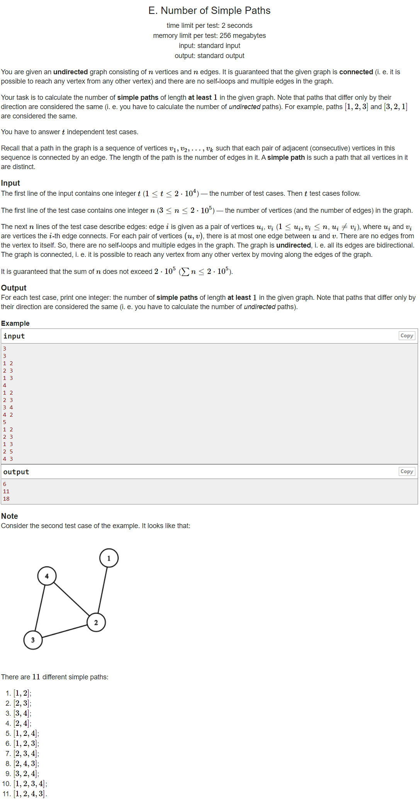

---
## 풀이
* `n`개의 vertex와 `n`개의 edge가 있고 graph가 connected 되어 있으므로, 반드시 1개의 cycle이 존재한다.
* graph를 구성하는 임의의 두 점을 선택했을 때, 그 두 점을 잇는 simple path의 개수는 path가 cycle을 구성하는 vertex를 2개 이상 거쳐가야 한다면 2개일 것이고, cycle을 구성하는 vertex를 2개 이상 거쳐가지 않아도 된다면 1개일 것이다. (반드시 둘 중 하나의 경우만 성립)
* 왜냐하면 cycle 내부의 vertex를 2개 이상 거쳐간다면 시계 방향으로 cycle을 거쳐가는 경우와 반시계 방향으로 cycle을 거쳐가는 path가 각각 존재하기 때문이다.
* 따라서 어떤 경우에 cycle 내부의 vertex를 2개 이상 거쳐가지 않는지를 알아야 하는데, 이는 cycle을 구성하는 어떤 vertex로부터 cycle 내부가 아닌 바깥쪽으로 뻗어나가는 tree를 구성하는 vertex들 중 2개의 vertex 사이의 simple path들이 이에 해당한다.
* 모든 두 쌍의 vertex 사이의 simple path의 개수는 `n*(n-1)/2*2`개이고, 여기서 cycle을 구성하는 각 vertex에 딸려 있는 tree안의 vertex들 사이 simple path의 개수를 제거해준 값이 정답이 된다.


* 참고로 여기서 m_i는 v_i에 속한 tree안의 vertex 개수를 의미한다.


```cpp
#include <bits/stdc++.h>
using namespace std;
using ll = long long int;
using pii = pair<int, int>;
using pll = pair<long, long>;
#define pb push_back
#define ppb pop_back
#define ff first
#define ss second
#define all(x) x.begin(), x.end()
#define rall(x) x.rbegin(), x.rend()
 
struct fast_ios { fast_ios() { ios::sync_with_stdio(false); cin.tie(NULL); } } fast_ios_;
 
/*--------------------------------------------------*/
 
#define MOD (int)(1e9+7)
#define LINF (ll)1e18
#define INF (int)1e9
 
int pre[200005], tmp;
bool vis[200005], cy[200005];
vector<int> adj[200005];
 
bool dfs(int ci, int p) {
	vis[ci] = true;
	for (int ni : adj[ci]) {
		if (ni==p) continue;
		if (vis[ni]) {
			cy[ni] = true;
			for (int i=ci; i!=ni; i=pre[i])
				cy[i] = true;
			return true;
		}
		else {
			pre[ni] = ci;
			if (dfs(ni, ci)) return true;
		}
	}
	return false;
}
 
void dfs2(int ci, int p) {
	for (int ni : adj[ci]) {
		if (ni==p || cy[ni]) continue;
		++tmp;
		dfs2(ni, ci);
	}
}
 
int solve() {
	int n; cin >> n;
	for (int i=1; i<=n; ++i) {
		vis[i] = cy[i] = false;
		adj[i].clear();
	}
	for (int i=0; i<n; ++i) {
		int a, b; cin >> a >> b;
		adj[a].pb(b);
		adj[b].pb(a);
	}
	dfs(1, -1);
	ll ans = 1ll*n*(n-1);
	for (int i=1; i<=n; ++i) {
		if (cy[i]) {
			tmp = 1;
			dfs2(i, -1);
			ans -= 1ll*tmp*(tmp-1)/2;
		}
	}
	printf("%lld\n", ans);
 
	return 0;
}
 
int main() {
	int t; cin >> t;
	while (t--)
		solve();
 
	return 0;
}
```

---
## 출처
https://codeforces.com/problemset/problem/1454/E