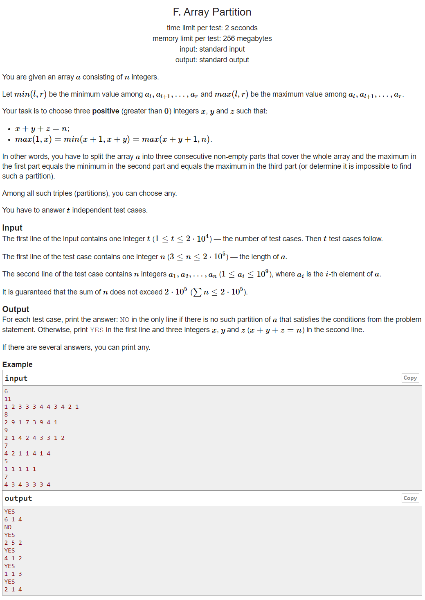

---
## 풀이
* 배열 `a`를 세 부분으로 나눈다.
* `x` = 왼쪽 부분의 max 값 = 중간 부분의 min 값 = 오른쪽 부분의 max 값
* 배열 `a`을 구성하는 원소 중 가장 큰 값을 `mx`로 선언한다.
* `mx`에 해당하는 값이 배열 `a`에 3개 이상 존재한다면, 그 중 2번째 `mx`값 하나만을 중간 부분으로 생각하고 배열을 세 부분으로 나누면 `x` = `mx`가 되어 반드시 문제의 조건을 만족한다.
* 그 외에 경우엔 `mx`에 해당하는 값이 1개이거나 2개일 것이다.
* 이 때에는 `mx`에 해당하는 값들이 3개보다 적기 때문에 `mx`가 세 부분에 각각 나누어져 포함될 수 없으므로 `x`는 `mx`보다는 작을 것이다.
* 그러면 이 경우에 `mx`에 해당하는 1~2개의 값은 반드시 중간 부분에만 포함되야 한다.
* 만약 왼쪽이나 오른쪽 부분에 `mx`가 포함이 된다면 왼쪽이나 오른쪽 부분의 max값은 `mx`가 될 것이기 때문이다.
* 따라서 중간 부분을 1~2개의 `mx`를 포함하는 최소한의 범위로 시작한 다음, 왼쪽이나 오른쪽으로 한 칸씩 늘려가며 문제의 조건을 만족하는지 확인하면 된다.
* 중간 부분을 한 칸씩 늘려가면 각 부분의 max, min, max값들은 셋 다 반드시 감소하거나 유지될 수 밖에 없게 된다.
* 따라서 x가 가능한 크게 유지되는 방향으로 중간 부분을 greedy하게 반복적으로 확장시킨다면 답을 구할 수 있다.
* 이를 위해 매번 확장을 위해 `min(각 부분의 max, min, max값)`이 더 크게 유지되는 방향을 선택한다.
* 만약 왼쪽과 오른쪽 끝까지 최대한으로 중간 부분을 확장시켜도 답을 찾지 못한 경우에는 답이 없다고 보면 된다.
* 각 부분에 대하여 max와 min값을 계속 체크해줘야되고, 삽입과 삭제 연산이 빈번하므로 왼쪽, 중간, 오른쪽 부분 모두 multiset을 사용해 원소를 관리한다.

```cpp
#include <bits/stdc++.h>
using namespace std;
using ll = long long int;
using pii = pair<int,int>;
using pll = pair<long,long>;
#define pb push_back
#define ppb pop_back
#define ff first
#define ss second
#define all(x) x.begin(), x.end()
#define rall(x) x.rbegin(), x.rend()
 
struct fast_ios { fast_ios() { ios::sync_with_stdio(false); cin.tie(NULL); } } fast_ios_;
 
/*--------------------------------------------------*/
 
#define MOD (int)(1e9+7)
#define LINF (ll)1e18
#define INF (int)1e9
 
void move(multiset<int> &as, multiset<int> &bs, int val) {
	as.erase(as.find(val));
	bs.insert(val);
}
 
bool ok;
 
void check(multiset<int> &ls, multiset<int> &ms, multiset<int> &rs) {
	if (ok || ls.empty() || rs.empty()) return;
	if (*ls.rbegin() == *ms.begin() && *ms.begin() == *rs.rbegin()) {
		ok = true;
		printf("YES\n%u %u %u\n", ls.size(), ms.size(), rs.size());
	}
}
 
int mini(multiset<int> &ls, multiset<int> &ms, multiset<int> &rs) {
	if (ok || ls.empty() || rs.empty()) return -1;
	return min({*ls.rbegin(), *ms.begin(), *rs.rbegin()});
}
 
int solve() {
	ok = false;
	int n; cin >> n;
	int mx = 0, cnt = 0;
	int li = -1, ri = -1;
	vector<int> ar(n);
	for (int &a : ar) {
		cin >> a;
		mx = max(mx, a);
	}
	for (int i=0; i<n; ++i) {
		if (ar[i]==mx) {
			++cnt;
			if (cnt==1) li = i, ri = i;
			else if (cnt==2) ri = i;
			else {
				return printf("YES\n%d %d %d\n", ri, 1, n-1-ri);
			}
		}
	}
 
	multiset<int> ls, ms, rs;
	for (int i=0; i<li; ++i) ls.insert(ar[i]);
	for (int i=li; i<=ri; ++i) ms.insert(ar[i]);
	for (int i=ri+1; i<n; ++i) rs.insert(ar[i]);
 
	check(ls, ms, rs);
 
	while (!ok && li-1 >=0 && ri+1 < n) {
		move(ls, ms, ar[li-1]);
		int lmin = mini(ls, ms, rs);
		move(ms, ls, ar[li-1]);
 
		move(rs, ms, ar[ri+1]);
		int rmin = mini(ls, ms, rs);
		move(ms, rs, ar[ri+1]);
		if (lmin > rmin) move(ls, ms, ar[--li]);
		else if (lmin < rmin) move(rs, ms, ar[++ri]);
		else if (lmin != -1) move(ls, ms, ar[--li]);
		else break;
 
		check(ls, ms, rs);
	}
	if (!ok) puts("NO");
 
	return 0;
}
 
int main() {
	int t; cin >> t;
	while (t--)
		solve();
 
	return 0;
}
```

---
## 출처
https://codeforces.com/problemset/problem/1454/F