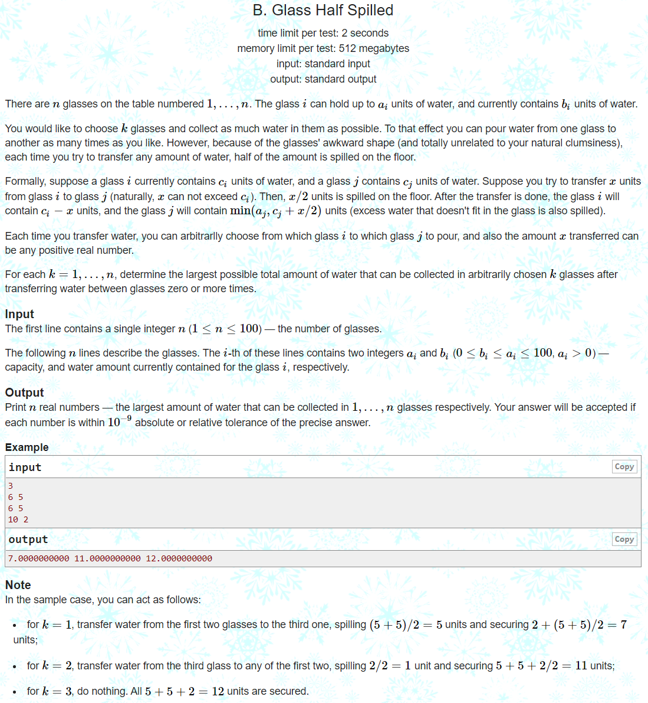

---
## 풀이
* 모든 컵들이 가지고 있는 물의 양의 합을 `sum`, 내가 선택한 컵들의 집합을 `x`, 그 집합이 현재 담고 있는 물의 양을 `S_x`라고 한다.
* 이 때 `x`에 속하지 않은 컵들이 담고 있는 물을 모두 `x`에 붓는다고 한다면 `x`가 담는 물의 양은 `S_x + (sum-S_x)/2`가 된다.
* 이를 풀어서 `(sum+S_x)/2`로 표현할 수 있다.
* 하지만 여기서 `x`가 가진 capacity의 합보다 `(sum+S_x)/2`가 크면 안되기 때문에 `x`가 가진 capacity의 합을 `C_x`라고 한다면 `x`가 실질적으로 담을 수 있는 물의 양은 `min(C_x, (sum+S_x)/2)`가 된다.
* 여기서 만약 각 `C_x`에 대해 가질 수 있는 최대의 `S_x`를 알게된다면 모든 `C_x`를 순회하며 `min(C_x, (sum+S_x)/2)`이 최대가 되는 집합 x를 구할 수 있다.
* 이는 dp로 쉽게 계산할 수 있다.
* `dp[a][b]`를 `a`개의 컵이 `b`만큼의 capacity를 가진 경우들 중 지금 담고 있는 물의 양의 최대값이라고 하자.
* 각각의 컵을 하나씩 확인해가면서 dp를 만들어간다. 점화식은 다음과 같다.
* `dp[j+1][k+cr[i]] = max(dp[j+1][k+cr[i]], dp[j][k]+sr[i])`
* 코드에서 `i`는 현재 확인하고 있는 컵의 index, `j`는 컵의 개수-1, `k`는 집합 `x`에 포함된 컵들의 현재 capacity의 합을 의미한다.
* `dp[0][0]` 부터 시작해서 컵을 하나씩 확인해가며 유의미한 값들만 계속 전개하면 되므로 dp의 값이 -1인 경우는 패스해도 된다.
* 업데이트 된 dp값이 다른 dp값에 영향을 줄 수 있으므로  `j`는 역순으로 돈다.
* `k+cr[i]`가 `100*n+5`값을 넘어 out of index 에러가 발생할 가능성은 없기에 범위체크는 안해줘도 된다.

```cpp
#include <bits/stdc++.h>
using namespace std;
using ll = long long int;
using pii = pair<int, int>;
using pll = pair<ll, ll>;
#define pb push_back
#define ppb pop_back
#define ff first
#define ss second
#define all(x) x.begin(), x.end()
#define rall(x) x.rbegin(), x.rend()

struct fast_ios { fast_ios() { ios::sync_with_stdio(false); cin.tie(NULL); } } fast_ios_;

/*--------------------------------------------------*/

#define MOD 998244353
#define LINF (ll)1e18
#define INF (int)1e9

int solve() {
	int n; cin >> n;
	vector<int> cr(n), sr(n);
	vector<vector<int> > dp(n+5, vector<int>(100*n+5, -1));
	int sum = 0;
	for (int i=0; i<n; ++i) {
		cin >> cr[i] >> sr[i];
		sum += sr[i];
	}
	dp[0][0] = 0;
	for (int i=0; i<n; ++i) {
		for (int j=i; j>=0; --j) {
			for (int k=0; k<=100*n; ++k) {
				if (dp[j][k] != -1)
					dp[j+1][k+cr[i]] = max(dp[j+1][k+cr[i]], dp[j][k]+sr[i]);
			}
		}
	}
	for (int j=1; j<=n; ++j) {
		double mx = 0;
		for (int k=0; k<=100*n; ++k) {
			if (dp[j][k] != -1)
				mx = max(mx, min((double)k, (double)(dp[j][k] + sum)/2));
		}
		printf("%lf ", mx);
	}


	return 0;
}

int main() {
	//int t; cin >> t;
	//while (t--)
		solve();

	return 0;
}
```

---
## 출처
https://codeforces.com/problemset/problem/1458/B