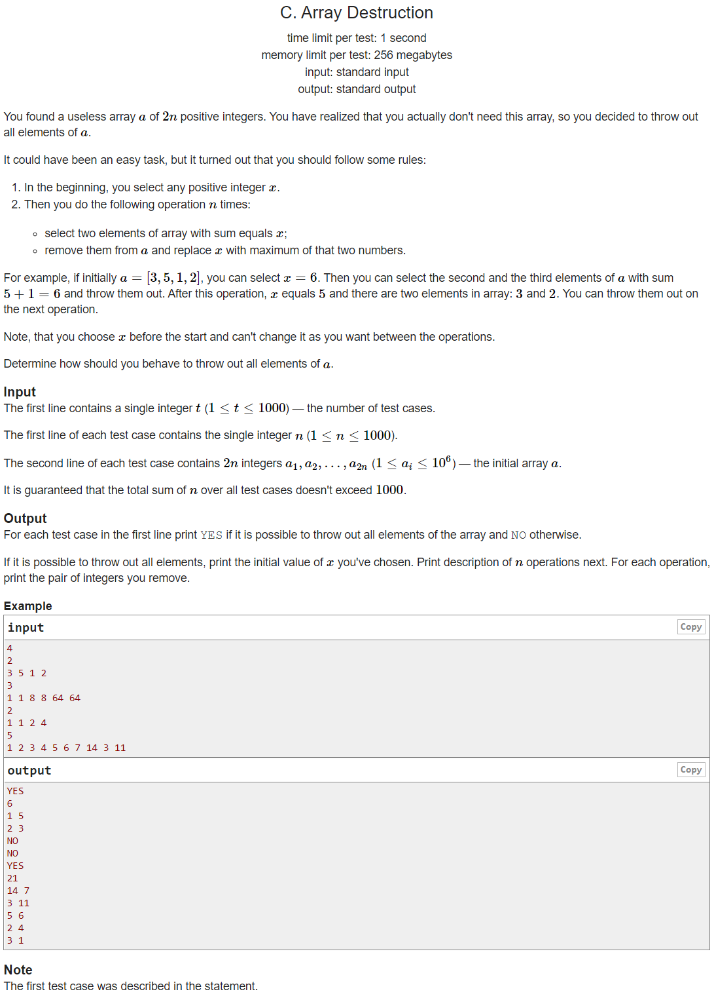

---
## 풀이
* 배열 `a`의 인덱스 i, j, k에 대하여 `x = a_i + a_j` 이고 i와 j번째 숫자를 지우려고 한다고 가정하자.
* 이 때 `x < a_k` 이면 `a_i`와 `a_j`가 지워지고 그 후 `max(a_i, a_j)`가 새로운 `x`가 되었을 때, `a_k`를 지울 방법이 없다.
* 따라서 배열의 숫자는 **현재 배열에서 가장 큰 수**, 그리고 **x에서 그 수를 뺀 값**. 이렇게 2가지의 숫자를 차례로 지워나가야함을 알 수 있다.
* 초기의 `x`값을 정해주면 그 다음부터 배열에서 차례로 지워지는 숫자들의 값은 정해져있다.
* 초기의 `x`값을 정하기위해서는 **배열에서 가장 큰 수**와 **그 수가 아닌 다른 수**의 합. 그렇게 총 `2n-1`번의 가지 수를 시도해보면 된다.
* input 값의 저장은 **동적인 삭제연산**이 가능하고 **최대값에 대한 접근**이 쉬우며, **배열의 요소를 중복**으로 다룰 수 있는 **multiset**을 사용한다.
* 아래 구현의 시간복잡도는 `O(n^2logn)`이다.


```cpp
#include <bits/stdc++.h>
using namespace std;
using ll = long long int;
using pii = pair<int, int>;
using pll = pair<ll, ll>;
#define pb push_back
#define ppb pop_back
#define ff first
#define ss second
#define all(x) x.begin(), x.end()
#define rall(x) x.rbegin(), x.rend()

struct fast_ios { fast_ios() { ios::sync_with_stdio(false); cin.tie(NULL); } } fast_ios_;

/*--------------------------------------------------*/

#define MOD (int)(1e9+7)
#define LINF (ll)1e18
#define INF (int)1e9


int solve() {
	int n; cin >> n;
	multiset<int> se;
	for (int i=0; i<2*n; ++i) {
		int a; cin >> a;
		se.insert(a);
	}
	for (auto it = next(se.rbegin()); it != se.rend(); ++it) {
		int sd = *it + *se.rbegin();
		int d = sd;
		multiset<int> ts = se;
		vector<pii> ans;
		while (!ts.empty()) {
			auto a = ts.end(); --a;
			auto b = ts.find(d-*a);
			if (b==ts.end() || a==b) break;
			d = max(*a, *b);
			ans.pb({*a, *b});
			ts.erase(a);
			ts.erase(b);
		}
		if (ts.empty()) {
			printf("YES\n%d\n", sd);
			for (pii &p : ans) printf("%d %d\n", p.ff, p.ss);
			return 0;
		}
	}
	return puts("NO");

	return 0;
}

int main() {
	int t; cin >> t;
	while (t--)
		solve();

	return 0;
}
```

---
## 출처
https://codeforces.com/problemset/problem/1474/C