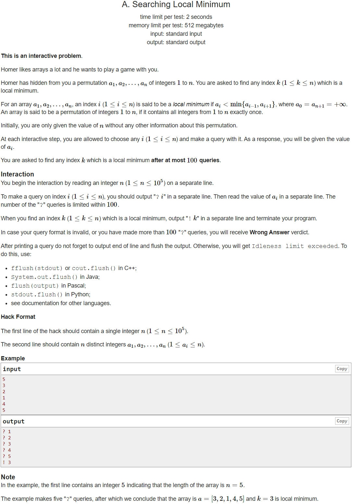

---
## 풀이
* `a_i > a_(i+1)`이고 `a_(j-1) < a_j`라면 `i < k < j`인 local minimum `k`가 존재한다.
* 배열은 permutation을 이루고 있으므로, 배열의 모든 인덱스에 `i`에 대해 반드시 `ar[i] < ar[i+1]` 혹은 `ar[i] > ar[i+1]`이 성립한다.
* 따라서 인덱스 `i`와 `j` 사이의 인덱스 `k`에 해당하는 값을 재귀적으로 구해가며 **local minimum을 가질 수 있는 조건을 유지해나가도록** 탐색 범위를 줄인다면 최종적으로 local minimum을 구할 수 있다.
* 탐색 범위의 왼쪽, 오른쪽 끝을 나타내는 인덱스를 각각 `l`과 `r`이라고 한다면 `l`을 0, `r`을 `n+1`로 초기화할 수 있다.
* 이분탐색을 위해 `l`과 `r`의 평균값을 구해 그것을 `m = (l+r)/2`이라고 하자.
* 이 때 다음의 두 케이스 중 하나가 반드시 성립한다.
  * `ar[m] > ar[m+1]`
  * `ar[m] < ar[m+1]`
* `ar[m] > ar[m+1]`일 경우에는 `l = m`을 적용하고, 
* `ar[m] < ar[m+1]`일 경우는 `r = m+1`으로 업데이트 한다.
* 이 과정을 반복하다보면 결국 `l+1 = m = r-1`인 상태가 되고, 이 때 인덱스 `m`이 local minimum이 된다.
```cpp
#include <bits/stdc++.h>
using namespace std;
using ll = long long int;
using pii = pair<int, int>;
using pll = pair<ll, ll>;
#define pb push_back
#define ppb pop_back
#define ff first
#define ss second
#define all(x) x.begin(), x.end()
#define rall(x) x.rbegin(), x.rend()
 
struct fast_ios { fast_ios() { ios::sync_with_stdio(false); cin.tie(NULL); } } fast_ios_;
 
/*--------------------------------------------------*/
 
#define MOD (int)(1e9+7)
#define LINF (ll)1e18
#define INF (int)1e9
 
 
int solve() {
	int n; cin >> n;
	vector<int> ar(n+5);
	ar[0] = ar[n+1] = INF;
 
	int l = 0, r = n+1;
	while (r-l>2) {
		int m = (l+r)/2;
		if (ar[m]==0) {
			printf("? %d\n", m);
			fflush(stdout);
			cin >> ar[m];
		}
		if (ar[m+1]==0) {
			printf("? %d\n", m+1);
			fflush(stdout);
			cin >> ar[m+1];
		}
		if (ar[m]<ar[m+1]) r = m+1;
		else l = m;
	}
	printf("! %d\n", (l+r)/2);
	fflush(stdout);
 
	return 0;
}
 
int main() {
	//int t; cin >> t;
	//while (t--)
		solve();
 
	return 0;
}
```

---
## 출처
https://codeforces.com/problemset/problem/1479/A