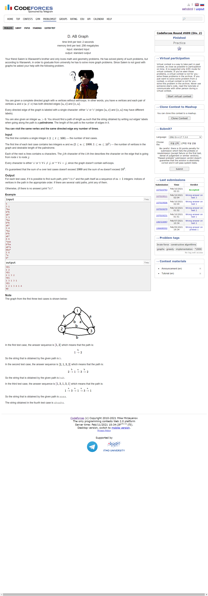

---
## 풀이
* 먼저 정점을 2개만 고려하여 생각해본다.
* 정점 2개를 잇는 방향있는 간선 2개의 label이 서로 **같을 경우**, 반드시 palindrome이 존재한다.
* 간선 2개의 label이 서로 **다를 경우**에는 `m`이 홀수인지, 짝수인지에 따라 나뉜다.
  * `m`이 **홀수**라면, 반드시 palindrome이 존재한다.
  * `m`이 **짝수**라면 palindrome은 존재하지 않는다.
    * 이 경우엔 **정점 3개를 고려**한다.
* 정점 3개를 고려하는 경우, 각각의 정점을 `v1`, `v2`, `v3`라고 한다.
* 정점을 순회하여 palindrome을 만드는 것이 유효하기 위해서는 다음의 조건을 반드시 만족해야 한다.
  * `v1` -> `v2`와 `v2` -> `v3`의 라벨이 같고, `v2` -> `v1`과 `v3` -> `v2`의 라벨이 같다. (이 라벨은 앞의 라벨과는 다르다)
* 이 조건을 만족하지 않는다면 정점 3개를 이용해 생성하는 문자열이 정점 2개로 만들 수 있는 문자열과 다를게 없기 때문이다.
* `m`이 짝수이기 때문에, `m`을 다음과 같은 두 경우로 나눈다면 반드시 palindrome을 만드는 것이 가능하다.
  * `m = 4*k`
  * `m = 4*k+2`
* `m`이 `4*k`인 경우는 `abba`가 `k`번 반복되도록 문자열을 생성하면 된다.
* `m`이 `4*k+2`인 경우는 `aa`에 더해 `bbaa`를 `k`번 반복해 이어주도록 문자열을 생성하면 된다.

```cpp
#include <bits/stdc++.h>
using namespace std;
using ll = long long int;
using pii = pair<int, int>;
using pll = pair<ll, ll>;
#define pb push_back
#define ppb pop_back
#define ff first
#define ss second
#define all(x) x.begin(), x.end()
#define rall(x) x.rbegin(), x.rend()
 
struct fast_ios { fast_ios() { ios::sync_with_stdio(false); cin.tie(NULL); } } fast_ios_;
 
/*--------------------------------------------------*/
 
#define MOD (int)(1e9+7)
#define LINF (ll)1e18
#define INF (int)1e9
 
 
int solve() {
	int n, m; cin >> n >> m;
	string sr[1005];
	for (int i=0; i<n; ++i) cin >> sr[i];
 
	if (m&1) {
		puts("YES");
		for (int a=0; a<m+1; ++a) {
			if (a&1) printf("2 ");
			else printf("1 ");
		}
		return puts("");
	}
 
	for (int i=0; i<n; ++i) {
		for (int j=0; j<n; ++j) {
			if (i==j) continue;
			if (sr[i][j]==sr[j][i]) {
				puts("YES");
				for (int a=0; a<m+1; ++a) {
					if (a&1) printf("%d ", j+1);
					else printf("%d ", i+1);
				}
				return puts("");
			}
		}
	}
 
	for (int i=0; i<n; ++i) {
		for (int j=0; j<n; ++j) {
			if (i==j) continue;
			for (int k=0; k<n; ++k) {
				if (sr[i][j]==sr[j][k]) {
					puts("YES");
					if ((m/2)&1) {
						for (int a=0; a<m+1; ++a) {
							if (a%4==0) printf("%d ", i+1);
							else if (a%4==2) printf("%d ", k+1);
							else printf("%d ", j+1);
						}
					}
					else {
						for (int a=0; a<m+1; ++a) {
							if (a%4==1) printf("%d ", k+1);
							else if (a%4==3) printf("%d ", i+1);
							else printf("%d ", j+1);
						}
					}
					return puts("");
				}
			}
		}
	}
	puts("NO");
 
	return 0;
}
 
int main() {
	int t; cin >> t;
	while (t--)
		solve();
 
	return 0;
}
```

---
## 출처
https://codeforces.com/problemset/problem/1481/D