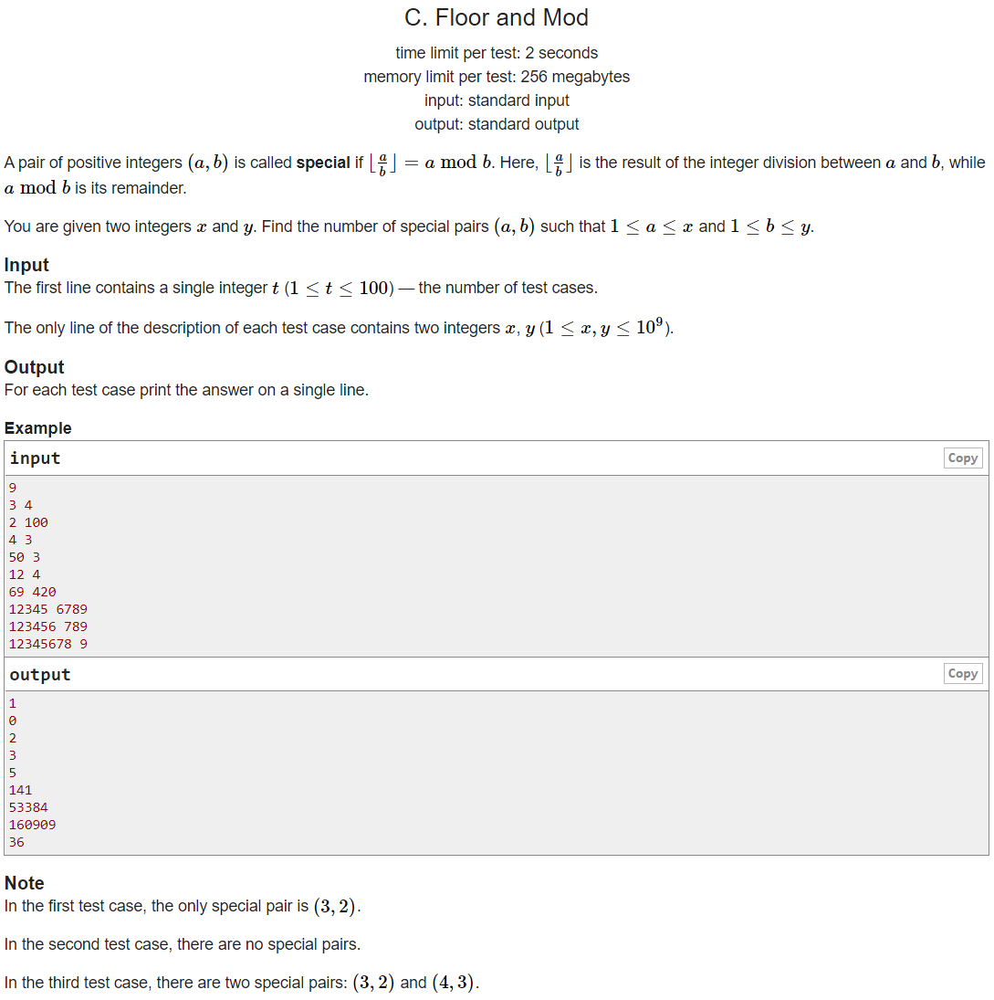

---
## 풀이 1
* `floor(a/b) = a mod b = k`
  * `a > 0` 이기 때문에 `k > 0` 이다.
* `b*floor(a/b)+(a mod b) = (b+1)*(a mod b)`
* `a = (b+1)*k` `(k < b)`
* `k*k < (k+1)*k < (b+1)*k = a <= x`
* `k < sqrt(x)`
* 위 조건을 만족하는 각 `k`에 대해 `b`를 특정하면 `a` 또한 하나로 정해진다.
* `b`를 정하기 위한 조건은 다음과 같이 3개가 있다.
* `1 <= (b+1)*k <= x` `1 <= b <= y` `k < b`
* `1 <= (b+1)*k <= x`는 `ceil(1/k)-1 <= b <= floor(x/k)-1`로 변환 가능하다.
* 조건을 모두 통합하면 얻는 식은 다음과 같다.
* `k < b <= min(y, floor(x/k)-1)`
* 따라서 각 k에 대해 정수 `b`의 개수는 `max(0, min(y, floor(x/k)-1) - k)`개로 정해진다.

```cpp
#include <bits/stdc++.h>
using namespace std;
using ll = long long int;
using pii = pair<int, int>;
using pll = pair<ll, ll>;
#define pb push_back
#define ppb pop_back
#define ff first
#define ss second
#define all(x) x.begin(), x.end()
#define rall(x) x.rbegin(), x.rend()
 
struct fast_ios { fast_ios() { ios::sync_with_stdio(false); cin.tie(NULL); } } fast_ios_;
 
/*--------------------------------------------------*/
 
#define MOD (int)(1e9+7)
#define LINF (ll)1e18
#define INF (int)1e9
 
 
int solve() {
	int x, y; cin >> x >> y;
	ll ans = 0;
	for (int k=1; k*k<x; ++k) {
		ans += max(0, min(y, x/k-1)-k);
	}
	printf("%lld\n", ans);
 
	return 0;
}
 
int main() {
	int t; cin >> t;
	while (t--)
		solve();
 
	return 0;
}
```

## 풀이 2
* 풀이 1과 같은 방식이지만 formal하지 않은 풀이법이다.
* `a`가 최대치인 `10^9` 값을 갖는다고 가정한다.
* `floor(a/b) = a mod b = k` 라고 `k`를 정하고, `b`를 1부터 서서히 증가시킨다.
* `1 <= b <= 10^4` 일 때는 `10^5 <= floor(a/b) <= 10^9` 이고 `1 < a mod b < 10^4` 이므로 식을 만족하는 `k`가 존재할 수 없다.
* 따라서 `1 <= b <= 10^4`인 경우를 모두 무시하여 `k`의 최대치를 `10^5` 까지만 고려한다.
* 이 때 `1 <= k <= 10^5`에 대하여 `a = (k+1)*k+k`, `b = k+1` 부터 시작하여 `a`를 `k`씩,  `b`를 `1`씩 각각 증가시켜가며 가능한 경우의 수를 모두 더해주면 정답을 구할 수 있다.

```cpp
#include <bits/stdc++.h>
using namespace std;
using ll = long long int;
using pii = pair<int, int>;
using pll = pair<ll, ll>;
#define pb push_back
#define ppb pop_back
#define ff first
#define ss second
#define all(x) x.begin(), x.end()
#define rall(x) x.rbegin(), x.rend()
 
struct fast_ios { fast_ios() { ios::sync_with_stdio(false); cin.tie(NULL); } } fast_ios_;
 
/*--------------------------------------------------*/
 
#define MOD (int)(1e9+7)
#define LINF (ll)1e18
#define INF (int)1e9
 
 
int solve() {
	int x, y; cin >> x >> y;
	ll ans = 0;
	for (int k=1; k<=100000; ++k) {
		ans += max(0, min(y-(k+1)+1, x/k-(k+2)+1));
	}
	printf("%lld\n", ans);
 
	return 0;
}
 
int main() {
	int t; cin >> t;
	while (t--)
		solve();
 
	return 0;
}
```

---
## 출처
https://codeforces.com/problemset/problem/1481/D