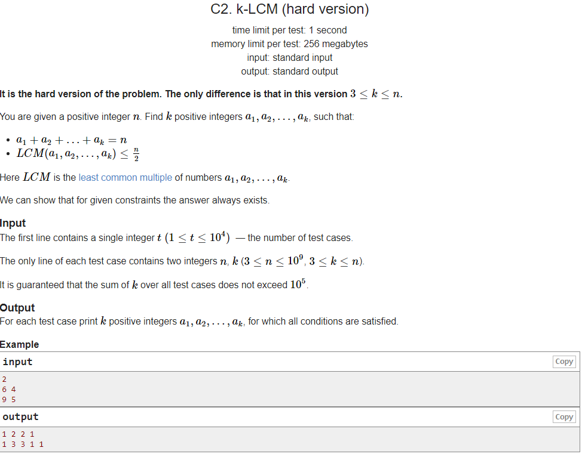

---
## 풀이
* `k=3`일 경우를 먼저 생각해본다.
  * `n`이 홀수일 경우, `a1`과 `a2`, `a3`이 각각 `1`, `(n-1)/2`, `(n-1)/2`으로 놓는다면 LCM은 `(n-1)/2`가 되고, 이는 `n/2`보다 작다.
  * `n`이 짝수일 경우는 2가지로 나눠진다.
    * `n = 4*d` 일 경우 `a1`과 `a2`, `a3`을 각각 `n/2`, `n/4`, `n/4`로 놓으면 LCM은 `n/2`가 되고 이는 `n/2`과 같다.
    * `n = 4*d+2` 일 경우 `a1`과 `a2`, `a3`을 각각 `2`, `n/2-1`, `n/2-1`로 놓으면 LCM은 `n/2-1`이 되고 이는 `n/2`보다 작다.
* 3보다 큰 `k`에 대해 `a4 ~ ak`를 전부 1로 설정한다고 하면 `a1 ~ ak`의 LCM은 `a1 ~ a3`의 LCM과 같아진다.
* `a1 + a2 + a3 = n-(k-4+1)`에 대하여 `LCM(a1 ~ ak) = LCM(a1, a2, a3) <= (n-(k-4+1))/2 <= n/2`이므로 위의 방식(`k`가 3개 있다고 가정했을 때의 방식)으로 `a1`, `a2`, `a3`을 계산하면 답을 구할 수 있다.

```cpp
#include <bits/stdc++.h>
using namespace std;
using ll = long long int;
using pii = pair<int, int>;
using pll = pair<ll, ll>;
#define pb push_back
#define ppb pop_back
#define ff first
#define ss second
#define all(x) x.begin(), x.end()
#define rall(x) x.rbegin(), x.rend()
 
struct fast_ios { fast_ios() { ios::sync_with_stdio(false); cin.tie(NULL); } } fast_ios_;
 
/*--------------------------------------------------*/
 
#define MOD (int)(1e9+7)
#define LINF (ll)1e18
#define INF (int)1e9
 
int solve() {
	int n, k; cin >> n >> k;
	int a = k-3;
	n -= a;
	if (n&1) printf("%d %d %d ", 1, n/2, n/2);
	else if (n%4) printf("%d %d %d ", 2, n/2-1, n/2-1);
	else printf("%d %d %d ", n/2, n/4, n/4);
	for (int i=0; i<a; ++i) printf("1 ");
	puts("");
 
	return 0;
}
 
int main() {
	int t; cin >> t;
	while (t--)
		solve();
 
	return 0;
}
```

---
## 출처
https://codeforces.com/problemset/problem/1497/C2